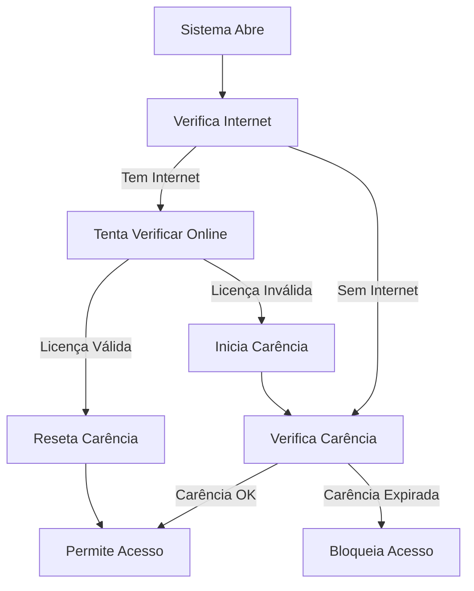

# Sistema de Verificação de Licença Melhorado

## 📋 Visão Geral

Este sistema implementa uma verificação de licença inteligente que:

- ✅ **Verifica licença sempre ao abrir o sistema**
- ✅ **Permite carência de 10 dias quando não há internet**
- ✅ **Reseta a contagem quando a internet volta**
- ✅ **Continua verificando online sempre que possível**

## 🚀 Funcionalidades

### 1. Verificação Contínua
- O sistema verifica a licença toda vez que é aberto
- Se há internet, tenta verificar online
- Se não há internet, usa o período de carência

### 2. Controle de Carência
- Máximo de 10 dias sem internet
- Contagem automática de dias utilizados
- Reset automático quando a internet volta

### 3. Verificação Online
- Comunicação com servidor de licença
- Validação de cliente ID e hardware ID
- Atualização automática do status

## 📁 Arquivos Criados/Modificados

### Novos Arquivos
- `docs/modules/Mod_VerificacaoLicenca.bas` - Módulo principal de verificação
- `docs/modules/Form_chk_Start_Novo.bas` - Formulário de verificação atualizado
- `docs/modules/Form_frm_StatusLicenca.bas` - Formulário de status da licença
- `docs/queries/Cs_CriarTblLicencaLocal.sql` - Consulta para criar/atualizar tabela
- `migracao_licenca.py` - Script de migração para sistemas existentes

### Arquivos Modificados
- `setup_loja.py` - Atualizado para incluir novos campos na tabela

## 🔧 Instalação

### Para Sistemas Novos

1. **Execute o instalador atualizado**
   ```bash
   python setup_loja.py
   ```

2. **Adicione os módulos VBA ao projeto**
   - Importe `Mod_VerificacaoLicenca.bas`
   - Substitua `Form_chk_Start.bas` por `Form_chk_Start_Novo.bas`
   - Adicione `Form_frm_StatusLicenca` (opcional)

3. **Execute a consulta SQL**
   - Execute `Cs_CriarTblLicencaLocal.sql` no Access

### Para Sistemas Existentes

1. **Execute o script de migração**
   ```bash
   python migracao_licenca.py "C:\FLMSistemas\FLMSistemas_be.accdb"
   ```

2. **Substitua os arquivos VBA**
   - Substitua `Form_chk_Start.bas` pelo novo
   - Adicione `Mod_VerificacaoLicenca.bas`

3. **Teste o sistema**
   - Verifique se a verificação funciona corretamente

## 🗄️ Estrutura da Tabela

A tabela `tblLicencaLocal` agora inclui:

```sql
CREATE TABLE tblLicencaLocal (
    ClienteID TEXT(100),           -- ID do cliente
    HardwareID TEXT(100),          -- ID único do hardware
    UltimaDataOk DATETIME,         -- Última verificação online bem-sucedida
    DataInicioCarencia DATETIME,   -- Data de início do período de carência
    DiasCarenciaUtilizados INTEGER, -- Dias de carência já utilizados
    LicencaValida BIT              -- Status atual da licença
);
```

## 🔄 Fluxo de Verificação



## ⚙️ Configuração

### URLs de Verificação
No módulo `Mod_VerificacaoLicenca.bas`, configure:

```vba
Private Const URL_VERIFICACAO As String = "https://api.flmsistemas.com.br/licenca/verificar"
Private Const URL_PING As String = "https://www.google.com.br"
```

### Período de Carência
```vba
Private Const MAX_CARENCIA_DIAS As Integer = 10
```

## 🧪 Testes

### Teste 1: Com Internet
1. Abra o sistema com internet
2. Verifique se a licença é validada online
3. Confirme que não há carência ativa

### Teste 2: Sem Internet
1. Desconecte a internet
2. Abra o sistema
3. Verifique se inicia período de carência
4. Confirme que funciona por 10 dias

### Teste 3: Internet Volta
1. Com carência ativa, conecte a internet
2. Abra o sistema
3. Verifique se a carência é resetada
4. Confirme verificação online

## 🐛 Solução de Problemas

### Erro: "Tabela não encontrada"
- Execute `Cs_CriarTblLicencaLocal.sql`
- Ou execute o script de migração

### Erro: "Módulo não encontrado"
- Verifique se `Mod_VerificacaoLicenca.bas` foi importado
- Confirme que não há erros de sintaxe

### Erro: "Verificação online falhou"
- Verifique a URL de verificação
- Confirme se o servidor está acessível
- Teste a conexão com internet

### Carência não funciona
- Verifique se os campos foram criados na tabela
- Confirme que a data de início está sendo salva
- Teste o cálculo de dias decorridos

## 📞 Suporte

Para problemas ou dúvidas:

1. Verifique os logs do sistema
2. Execute o script de migração novamente
3. Teste com um backend limpo
4. Entre em contato com o suporte técnico

## 🔄 Atualizações Futuras

### Próximas Versões
- Interface gráfica para configuração
- Logs detalhados de verificação
- Múltiplos servidores de verificação
- Backup automático de licenças

### Compatibilidade
- Mantém compatibilidade com sistemas existentes
- Migração automática de dados
- Rollback em caso de problemas

---

**Desenvolvido por FLM Sistemas**
*Sistema de Gestão Empresarial Completo* 